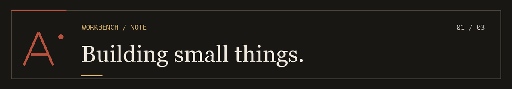
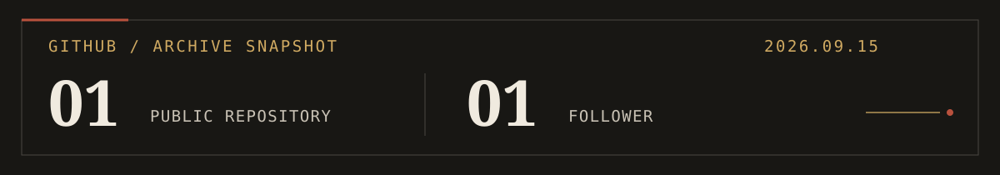

  

  

  PERSONAL ARCHIVE &nbsp; / &nbsp; DIGITAL WORKSHOP &nbsp; / &nbsp; FIELD NOTES

---

### 01 / About Me

I'm AraMayce. I build small, focused things to understand how they work, then keep a record of the decisions behind them. This profile is an index of that work: part workshop, part field notebook.

I care about the process as much as the result. The useful part of a project is often the question it leaves behind.

### 02 / Currently · Now

- Building [Ara Mayce](https://ara-mayce.nelvox-personal-site.workers.dev/projects/ara-mayce-site), a personal space for projects and field notes.
- Turning this GitHub profile into a living archive instead of a badge wall.
- Writing down what I learn while the work is still in progress.

[Open the current log →](https://ara-mayce.nelvox-personal-site.workers.dev/now)

### 03 / Projects

**[Ara Mayce · digital workshop](https://ara-mayce.nelvox-personal-site.workers.dev/projects/ara-mayce-site)**

`PROJECT 001 / IN PROGRESS` — A personal site where projects, decisions, and notes can grow together.

**[GitHub profile archive](https://github.com/Nelvox42/Nelvox42)**

`WORKBENCH / ACTIVE` — The banner, motion strip, and README you are reading now. An exercise in giving the work a recognizable home.

### 04 / Field Notes · Writing

Notes are not an afterthought here; they are how I remember why a project took its shape.

- [从一个名字开始 · Starting with a name](https://ara-mayce.nelvox-personal-site.workers.dev/notes/start-with-a-name)
- [为什么记录项目过程 · Why document the process](https://ara-mayce.nelvox-personal-site.workers.dev/notes/why-document-the-process)

[Browse all field notes →](https://ara-mayce.nelvox-personal-site.workers.dev/notes)

### 05 / Learning

My learning loop is simple: make something small, look under the surface, write down what changed my mind.

- `01` Web foundations and how interfaces are put together
- `02` Git, GitHub, and the workflow behind shipping
- `03` Clearer project notes and better questions

### 06 / GitHub Stats

A dated archive snapshot, not a live scoreboard. [See current activity →](https://github.com/Nelvox42?tab=overview)

### 07 / Connect

[GitHub](https://github.com/Nelvox42) &nbsp;·&nbsp; [Digital workshop](https://ara-mayce.nelvox-personal-site.workers.dev/) &nbsp;·&nbsp; [Field notes](https://ara-mayce.nelvox-personal-site.workers.dev/notes)

---

Build. Learn. Document. &nbsp;—&nbsp; ARAMAYCE

